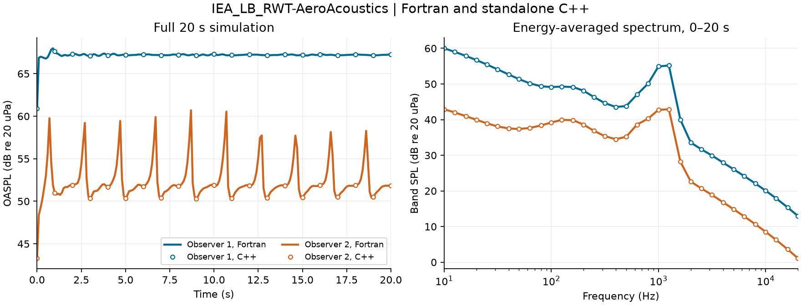

# Aeroacoustics_cpp

OpenFAST 气动声学的 C++17 实现，支持 Intel oneMKL，并通过 C ABI 接入 OpenFAST 官方整机算例。

## 已实现的算法

- BPM：层流边界层涡脱落、湍流边界层尾缘噪声（压力面／吸力面／分离）、尾缘钝度、叶尖噪声。
- Lowson 入流湍流噪声和 Simplified Guidati 厚度修正。
- TNO 尾缘噪声、61 点 Gauss–Kronrod 积分及误差诊断。
- A 计权、声能叠加、观察点坐标变换、叶片声学节点选择、边界层表读取与插值、两种湍流强度状态更新、声学时间循环。
- MKL 后端实际调用 `vdExp`、`cblas_dgemv` 和 `cblas_ddot` 计算 TNO 积分；整机验证的 BLAS/LAPACK 也使用 MKL。

这是既有经验模型的代码移植，不是 CFD 声源求解器。边界层表厚度乘弦长转换为米，雷诺数使用绝对值而非百万单位；角度除入流噪声迎角为弧度外均为度。声级参考声压为 20 μPa。

## 快速开始

需要 CMake ≥3.20 和支持 C++17 的编译器。

```sh
cmake -S . -B build -DCMAKE_BUILD_TYPE=Release
cmake --build build --config Release -j 4
./build/aeroacoustics_example spectrum.csv
```

Windows PowerShell，使用已经安装的 GCC 16.2.0：

```powershell
. ./tools/use_gcc.ps1
cmake -S . -B build-gcc16 -G 'MinGW Makefiles' -DCMAKE_BUILD_TYPE=Release
cmake --build build-gcc16 -j 4
./build-gcc16/aeroacoustics_example.exe spectrum.csv
```

其他安装位置使用 `. ./tools/use_gcc.ps1 -GccBin '你的 mingw64/bin 路径'`。新工具链安装在 `D:/Code_Configuration/gcc-16.2.0`。

默认截面来自 OpenFAST `Aero_Tests` 的数值设置，输出 34 个频带和 7 类声源，OASPL 约为 **83.30258655488 dB**。

## 使用 Intel oneMKL

```powershell
. ./tools/use_gcc.ps1
$mklRoot = 'C:/Program Files (x86)/Intel/oneAPI/mkl/2025.2'
$env:PATH += ";$mklRoot/bin"
$env:MKL_THREADING_LAYER = 'SEQUENTIAL'
cmake -S . -B build-gcc16-mkl -G 'MinGW Makefiles' -DCMAKE_BUILD_TYPE=Release -DAEROACOUSTICS_USE_MKL=ON "-DMKL_DIR=$mklRoot/lib/cmake/mkl"
cmake --build build-gcc16-mkl -j 4
./build-gcc16-mkl/aeroacoustics_example.exe spectrum-mkl.csv
```

MinGW 使用 MKL 单一动态接口 `mkl_rt`，避免直接链接包含 MSVC 专用对象的组件库。运行时需 MKL DLL 位于 PATH。MKL 是可选外部依赖，不随代码分发；不能据此保证每个小规模计算都更快。

## 官方完整算例

目标为 [IEA_LB_RWT-AeroAcoustics](https://github.com/OpenFAST/r-test/tree/dd5feaaaa500ba7283140107806300d551cff0a7/glue-codes/openfast/IEA_LB_RWT-AeroAcoustics)：20 秒、0.00625 秒耦合步长、3 个叶片、每片 30 个气动节点、2 个观察点、34 个声学频带，声学输出间隔 0.1 秒。

下载脚本固定 OpenFAST 和 r-test 提交，不依赖变化中的 main 分支。整机接入只替换 7 个频谱计算入口，Fortran 外层继续提供真实气动状态。源代码补丁位于 [integration/openfast-cpp.patch](integration/openfast-cpp.patch)，流程见 [docs/full-case.md](docs/full-case.md)。

## 验证

开发验证需要 Python 3.11+、NumPy；直接 Fortran 对比还需 GFortran。

```powershell
. ./tools/use_gcc.ps1
cmake -S . -B build-gcc16 -DAEROACOUSTICS_BUILD_TESTS=ON
cmake --build build-gcc16 -j 4
python tests/compare_python.py build-gcc16/libaeroacoustics_shared.dll --fortran-compiler $env:FC --report docs/validation-gcc16-portable.json
python tests/compare_auxiliary.py build-gcc16/auxiliary_probe.exe --report docs/validation-auxiliary.json
```

验证 MKL DLL 前，追加 `$env:AEROACOUSTICS_RUNTIME_DIRS += ";$mklRoot/bin"`。

| 验证 | 实测范围 | 最大绝对差异 |
| --- | --- | --- |
| C++ / Python，普通版及 MKL 版 | 各 204 工况、56,576 个频谱值，含 16 个 TNO 工况 | 2.84e-14 dB |
| C++ / 原 Fortran 数值体，双精度 | 同上 | 4.55e-13 dB |
| 辅助算法 / Python | 34,512 个数值，含两种湍流状态与多节点时间循环 | 5.68e-14 |
| 官方 20 秒整机 / 原版 Fortran | 145,926 个声学输出值；106,128 次 C++ 内核调用 | 文本输出数值完全一致 |

整机的全部动力学输出字节也一致，仅文件说明中的运行生成时间戳不同。完整报告见 [validation-full-case.json](docs/validation-full-case.json)，导出的时间序列与平均频谱见 [examples/results](examples/results)。



直接 Fortran 数值验证对原例程的实数字面量使用双精度编译，与本次 OpenFAST `DOUBLE_PRECISION=ON` 一致。单精度运行可能在很低的声级处出现下溢；本项目的数值实现使用 double。

模型保留上游特殊约定：启用例程的某些早退返回 0 dB，TNO 使用固定积分面板，上游叶片节点起始索引和湍流缓冲区索引也予以保留。C++ 独立装配中的关闭声源使用 `-inf` 表示零能量。源代码测试不等于实验声学验证。

## 文件导航

- `include/aeroacoustics.hpp`：C++ 参数、截面、观察点、边界层与时间驱动接口。
- `include/aeroacoustics_c.h`：Fortran 和其他语言可调用的 C ABI，包含参数顺序与单位。
- `src/kernels.cpp`：可直接阅读、编译的经验声学公式。
- `src/aeroacoustics.cpp`：TNO、积分、声源装配和几何。
- `src/driver.cpp`：表格插值与时间状态。
- `reference/`：原 Python 和 Fortran 对照源码；仅开发验证使用。
- `tools/`：可重现下载、接口补丁和完整算例运行脚本。
- `docs/validation-*.json`：实际测试记录。

Apache-2.0，来源和修改说明见 [NOTICE](NOTICE) 与 [LICENSE](LICENSE)。
