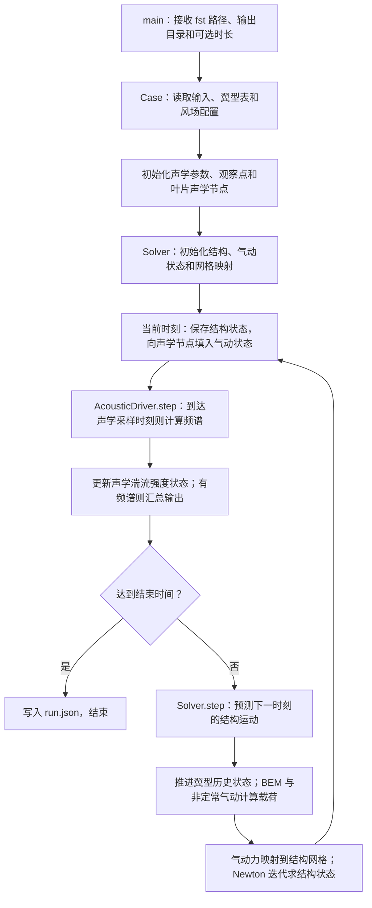

# IEA_LB_RWT-AeroAcoustics 工作流

本文沿着 `aeroacoustics_turbine` 的实际 C++ 调用链，说明官方算例从输入文件到结构、气动和声学结果的计算过程。源码依据：`364a128`（源码模块化后的版本）。文中的函数名均可在链接的源码中查到；调用树省略了标准库函数和通用向量运算。

程序入口是 [src/apps/turbine_main.cpp](src/apps/turbine_main.cpp) 中的 `main()`。整机运行直接调用 C++ 模块，读取 OpenFAST 格式的输入文件；不启动 OpenFAST 可执行程序，也不调用 Fortran 或 Python。Fortran 参考程序属于验证流程，不进入下面的运行链。

## 1. 先看整条计算链



这里有两条不同的联系：气动与结构通过运动和载荷双向传递；声学读取叶片位置、速度、攻角等结果，声压不反过来参与结构或气动求解。

默认工况有三片叶片，每片三个结构模态，共九个结构自由度。转速和桨距固定，塔架、平台、传动链及控制器的动力学在该输入中关闭。

## 2. 程序输入什么

### 2.1 命令行入口

在仓库根目录运行已编译的程序，例如 Windows / MinGW：

```powershell
./build/aeroacoustics_turbine.exe examples/IEA_LB_RWT-AeroAcoustics/IEA_LB_RWT-AeroAcoustics.fst build/results
```

两个必需参数分别是主输入文件和输出目录。可选的第三个参数覆盖 `TMax`，例如末尾加 `2` 表示运行到约 2 秒的时间网格位置。默认算例运行到 20 秒。构建命令见 [README](README.md)。

### 2.2 输入文件之间的引用关系

以下文件均位于 [examples/IEA_LB_RWT-AeroAcoustics](examples/IEA_LB_RWT-AeroAcoustics)：

```text
IEA_LB_RWT-AeroAcoustics.fst
├─ EDFile → RotorSE_FAST_IEA_landBased_RWT_ElastoDyn.dat
│  └─ BldFile(1..3) → RotorSE_FAST_IEA_landBased_RWT_ElastoDyn_blade.dat
├─ InflowFile → RotorSE_FAST_IEA_landBased_RWT_InflowFile.dat
└─ AeroFile → RotorSE_FAST_IEA_landBased_RWT_AeroDyn.dat
   ├─ ADBlFile(1..3) → RotorSE_FAST_IEA_landBased_RWT_AeroDyn_blade.dat
   ├─ AFNames → Airfoils/RotorSE_FAST_IEA_landBased_RWT_AeroDyn_Polar_00.dat … 29.dat
   │  ├─ NumCoords → AFxx_Coords.txt：翼型轮廓和参考点
   │  └─ BL_file   → AFxx_BL.txt：尾缘几何及边界层数据
   └─ AA_InputFile → AeroAcousticsInput.dat
      └─ ObserverLocations → AA_ObserverLocations.dat
```

文件名相对于**引用它的输入文件所在目录**解析。三片叶片使用相同的结构属性表和气动站位表，但各自保存运动状态和非定常翼型历史状态。目录中的 `AA_ObserverLocations_Map.dat` 没有被当前 `ObserverLocations` 引用，因此不参与本次计算。

### 2.3 时间、环境和风场参数

| 来源 | 参数 | 官方值 | 进入哪里、起什么作用 |
| --- | --- | --- | --- |
| `.fst` | `TMax`、`DT` | 20 s、0.00625 s | `Case` → `Solver`：总时长和时间步长 |
| `.fst` | `ModCoupling`、`NumCrctn` | 3、0 | `Solver` 检查耦合配置，执行第 4 节所述推进顺序 |
| `.fst` | `RhoInf` | 0 | `Solver` 计算广义 α 积分系数 |
| `.fst` | `AirDens` | 1.225 kg/m³ | 气动力动压及声学模型 |
| `.fst` | `KinVisc` | 1.81206×10⁻⁵ m²/s | 雷诺数和边界层模型 |
| `.fst` | `SpdSound` | 335 m/s | 非定常气动、马赫数和声学模型 |
| `.fst` | `Gravity` | 9.80665 m/s² | `BladeStructure::acceleration()` 中的重力项 |
| Inflow 文件 | `WindType`、`HWindSpeed` | 1、8 m/s | `SteadyWind`：稳态风速 |
| Inflow 文件 | `RefHt`、`PLExp` | 110 m、0 | 幂律风切变；指数为 0 时风速不随高度变化 |
| Inflow 文件 | `PropagationDir`、`VFlowAng` | 0°、0° | 风向和垂直入流角 |

AeroDyn 文件中的 `AirDens`、`KinVisc`、`SpdSound` 当前为 `default`，采用 `.fst` 中的值；如果改成数值，则由 AeroDyn 值覆盖。`main()` 再将最终环境参数写入声学 `Parameters`，使气动与声学使用一致的介质属性。

### 2.4 结构与气动参数

| 来源 | 参数或数据 | 官方设置与用途 |
| --- | --- | --- |
| ElastoDyn 文件 | `NumBl`、`BldNodes` | 3 片叶片；每片 17 个结构积分节点，加根部和尖部形成 19 个运动节点 |
| ElastoDyn 文件 | `FlapDOF1`、`FlapDOF2`、`EdgeDOF` | 均开启：一阶挥舞、二阶挥舞、一阶摆振 |
| ElastoDyn 文件 | `RotSpeed`、`BlPitch(1..3)` | 固定 10.04 rpm、固定 1.17° |
| ElastoDyn 文件 | `TipRad`、`HubRad` | 65 m、2 m；柔性叶片长度为 63 m |
| ElastoDyn 文件 | `PreCone(1..3)`、`ShftTilt` | −2.5°、−5°，用于叶片与转子坐标变换 |
| ElastoDyn 文件 | `TowerHt`、`Twr2Shft` | 110 m、3.0934301742 m，用于轮毂几何位置 |
| 结构叶片文件 | `BlFract`、结构扭角、`BMassDen`、`FlpStff`、`EdgStff` | 插值质量和刚度分布，建立模态质量、刚度和阻尼 |
| 结构叶片文件 | `BldFl1Sh(2..6)`、`BldFl2Sh(2..6)`、`BldEdgSh(2..6)` | 三个模态的多项式系数 |
| 结构叶片文件 | `AdjBlMs`、`AdjFlSt`、`AdjEdSt`、`FlStTunr`、模态阻尼参数 | 调整质量、刚度和阻尼 |
| 气动叶片文件 | `NumBlNds` | 每片 30 个气动站位，全转子 90 个 |
| 气动叶片文件 | `BlSpn`、`BlCrvAC`、`BlSwpAC`、`BlCrvAng`、`BlTwist`、`BlChord`、`BlAFID` | 展向位置、预弯、后掠、局部角度、弦长和翼型索引 |
| AeroDyn 文件 | `Wake_Mod=1`、`BEM_Mod=1`、`DBEMT_Mod=0` | BEM 诱导求解，关闭动态入流状态模型 |
| AeroDyn 文件 | `TipLoss`、`HubLoss`、`TanInd` | 均开启：叶尖/叶根损失、切向诱导 |
| AeroDyn 文件 | `AIDrag`、`TIDrag` | 均关闭：诱导方程不计阻力项；最终气动力仍使用 `Cd` |
| AeroDyn 文件 | `Skew_Mod=1`、`SkewRedistr_Mod=default` | 按当前默认值执行偏斜尾流诱导重分布 |
| AeroDyn 文件 | `IndToler=default`、`MaxIter=100` | BEM 残差容差采用 5×10⁻¹⁰，最大迭代次数 100 |
| AeroDyn 文件 | `UA_Mod=3`、`FLookup=True` | Minnema/Pierce 非定常翼型模型，使用翼型表 |
| 翼型极曲线 | `NumAlf` 后的 `α, Cl, Cd, Cm` | `Airfoil::at()` 按攻角做线性插值 |
| 翼型极曲线 | `alpha0`、`C_nalpha`、`T_f0`、`T_V0`、`T_p`、`T_VL`、`b1/b2/b5`、`A1/A2/A5` 等 | 非定常模型的斜率、迟滞、分离和涡状态参数 |

极曲线文件的攻角以度给出，气动计算内部使用弧度；传给声学模块时再转换成度。这里的九个 `q` 是模态位移，九个 `qd` 是模态速度；30 个气动站位不是额外的结构自由度。

### 2.5 声学参数

| `AeroAcousticsInput.dat` 字段 | 官方值 | 用途 |
| --- | --- | --- |
| `DT_AA`、`AAStart` | 0.1 s、0 s | 声学计算/输出间隔与开始时间 |
| `BldPrcnt` | 70 | 从叶尖侧选取发声区域，由 `blade_elements()` 转换成离散节点及展向长度 |
| `TIMod` | 2 | 入流噪声加 Simplified Guidati 厚度修正 |
| `TICalcMeth`、`TI`、`avgV` | 1、0.1、8 m/s | 将指定湍流强度换算为各截面入射湍流强度 |
| `Lturb` | 40 m | 入流噪声的湍流长度尺度 |
| `TBLTEMod`、`BLMod`、`TripMod` | 1、1、1 | BPM 湍流边界层尾缘噪声；经验边界层；重绊线设置 |
| `BluntMod` | 1 | 启用尾缘钝度涡脱落噪声，读取 `TEThick`、`TEAngle` |
| `LamMod`、`TipMod` | 0、0 | 当前关闭层流边界层噪声和叶尖涡噪声 |
| `AWeighting` | False | 输出未加 A 计权的声级 |
| `NrOutFile` | 4 | 写入全部四类声学结果 |
| `AAOutFile` | `IEA_LB_RWT-AeroAcoustics_` | 输出文件名前缀 |

观察点为 `(175, 0, 2)` m 和 `(0, 175, 2)` m，采用塔基坐标系。34 个频带中心频率在 [include/aeroacoustics.hpp](include/aeroacoustics.hpp) 的 `Parameters::freqlist` 中定义，范围为 10–20000 Hz，并非从本算例的 AA 输入文件读取。

`TI=0.1` 用于入流噪声模型，不会在 `SteadyWind` 中生成随机湍流风场。`avgV` 和 `HWindSpeed` 是两个独立输入；修改风场速度时，程序不会自动修改声学 `avgV`。

## 3. 启动时先调用哪些模块

下面按照 `main()` 的执行顺序列出初始化调用；缩进表示调用或对象构造关系。

```text
main()
├─ 1. turbine::Case(fst_path)
│  ├─ InputFile()：依次读取主文件、结构、气动、风场、声学、结构叶片文件
│  │  ├─ tokenize()：识别字段、引号和注释
│  │  └─ value()/number()/integer()/flag()/file()：取得参数和文件路径
│  ├─ SteadyWind()：保存速度、风向、风切变参数
│  ├─ Case::validate_scope()：检查模块、自由度、模型和时间步设置
│  ├─ InputFile::table_after()：读取 30 个气动站位
│  └─ InputFile::files_after() → Airfoil()：读取 30 份极曲线及翼型坐标
├─ 2. read_aa_input()、read_observers()：建立声学 Parameters 和观察点数组
├─ 3. blade_elements()、AcousticDriver()
│  ├─ TurbulenceState()：建立每个叶素的湍流强度状态，初值为 0
│  └─ blade_elements()：保存声学节点范围和每段展向长度
├─ 4. 建立每片叶片的 Node 数组
│  ├─ 写入弦长、失速参考角 alpha1、翼型参考点
│  ├─ guidati_thickness()：从翼型轮廓提取 1% 和 10% 弦长附近的厚度
│  └─ InputFile(BL_file)：读取 TEThick、TEAngle
├─ 5. 建立四个声学输出文件和 dynamics.csv
└─ 6. turbine::Solver(c)
   ├─ Rotor(c)
   │  ├─ BladeStructure(c) → shape()：构造模态、节点、质量、刚度和阻尼
   │  ├─ BladeStructure::motion()/blade_basis()：建立参考运动和坐标系
   │  ├─ UnsteadyAirfoil()：为每片叶片的每个气动站位建立独立历史状态
   │  └─ MotionMap()、LoadMap()：预先建立运动和载荷映射关系
   ├─ 计算广义 α 时间积分系数
   └─ Rotor::evaluate(0, state)：计算 t=0 的气动状态
```

`Case` 的首个任务是解析文件；真正首次执行气动求解发生在 `Solver` 构造末尾的 `Rotor::evaluate(0, state)`。默认初始模态位移、速度和积分器加速度数组为零，此处不会额外求解一次初始结构加速度。

默认 `BLMod=1`、`TBLTEMod=1`，第 4 步只从 `BL_file` 取得尾缘几何，不执行 `BLTable::read()` 的完整边界层表读取。后者用于表格边界层或 TNO 分支。

## 4. 一个时间步怎样推进

### 4.1 主循环的顺序

主循环从 `t=0` 开始。每次先保存当前时刻的结果，再推进到下一个时刻：

1. 将 `solver.state` 中三片叶片的 `q` 和 `qd` 写入 `dynamics.csv`。
2. 从 `solver.aerodynamic` 向 90 个声学 `Node` 填入位置、方向、风速、截面相对速度和攻角。
3. 调用 `AcousticDriver::step(time, nodes)`；若到达声学采样时刻，则返回频谱快照并写入结果。
4. 达到结束时间则退出；否则调用 `Solver::step()`。

默认 `DT_AA / DT = 16`。因此 `AcousticDriver::step()` 每个整机时间步都调用，但完整频谱每 16 步计算一次。0–20 s 共推进 3200 步，保存 3201 行结构数据和 201 个声学时刻，均包含 `t=0`。

### 4.2 `Solver::step()` 的真实调用顺序

源码：[src/turbine/coupling/solver.cpp](src/turbine/coupling/solver.cpp)。

```text
Solver::step()
├─ 根据上一时刻 q、qd、加速度和算法加速度，预测 q_pred、qd_pred
├─ Rotor::advance_airfoils(上一时刻气动结果, step_number)
│  ├─ UnsteadyAirfoil::advance()：推进翼型历史状态
│  └─ 保存上一时刻未经偏斜修正的 BEM 根 root_phi
├─ Rotor::evaluate(t_next, predicted)：用预测运动计算一次新气动状态和载荷
└─ 结构 Newton 迭代，最多 12 次
   ├─ Rotor::structural_loads(t_next, 当前迭代状态, 已算气动力)
   │  ├─ BladeStructure::motion()：计算当前结构节点位置
   │  └─ LoadMap::transfer()：把气动分布载荷映射为结构节点载荷
   ├─ 对每片叶片调用 BladeStructure::acceleration()
   │  └─ solve3()：解模态质量方程，得到三分量结构加速度
   ├─ 扰动各模态，重复载荷映射和加速度计算，构造数值 Jacobian
   ├─ solve3()：解 Newton 修正方程，修正加速度、q、qd
   └─ 检查修正量；收敛后保存状态并更新时间
```

**气动计算发生在结构 Newton 迭代之前。** 在这个迭代内，气动分布载荷保持为预测运动算出的值；结构节点位置和载荷力臂随结构修正而更新。不会在每次 Newton 迭代中重算 BEM，也不会在收敛后再调用一次 `Rotor::evaluate()`。

因此，同一时刻 `dynamics.csv` 保存的是修正后的结构状态，声学读取的是该步缓存的气动状态及其预测运动几何。下一步预测继续使用修正后的结构状态。这个先后顺序决定了气动、结构和声学之间的数据对应关系。

### 4.3 结构迭代求解什么

每片叶片的未知量是三个模态加速度。设当前猜测为 `a`，结构方程返回的加速度为 `f(q, qd, loads)`，残差为：

```text
r = f(q, qd, loads) - a
q  = q_pred  + beta_prime  * a
qd = qd_pred + gamma_prime * a
```

`beta_prime`、`gamma_prime` 来自 `DT`、`RhoInf` 对应的广义 α 系数。数值 Jacobian 的扰动量为 `h=1e-4`；每次迭代通过一个 3×3 系统求修正量。三片叶片的最大修正量范数小于 `1e-9` 时结束，12 次内不收敛则报错。

这里的 `1e-9` 和 12 次来自 C++ 求解器实现；输入文件里的 `ConvTol`、`MaxConvIter`、`DT_UJac` 等字段并未用于设置这段 Newton 循环。

## 5. 气动求解内部调用哪些函数

### 5.1 从叶片运动得到叶素气动力

协调入口：[src/turbine/coupling/rotor.cpp](src/turbine/coupling/rotor.cpp) 的 `Rotor::evaluate()`。

```text
Rotor::evaluate(time, state)
├─ 对三片叶片建立节点运动
│  ├─ BladeStructure::motion() → blade_basis()、small_rotation()
│  ├─ MotionMap::transfer() → interpolate_rotation() → rotation_log()/rotation_exp()
│  ├─ SteadyWind::at(position)：求节点处的环境风速
│  └─ euler_angles()/euler_matrix()：建立叶素局部和环带坐标系
├─ 计算转子平均相对入流、偏斜角和低叶尖速比过渡权重
└─ 对三片叶片的 30 个站位分别计算
   ├─ solve_bem()：求未作偏斜修正的诱导状态
   ├─ skew_axial()：按模型开关修正轴向诱导
   ├─ 计算修正后的 phi、alpha 和相对速度 U
   ├─ UnsteadyAirfoil::evaluate(alpha, U)：求最终 Cl、Cd、Cm
   └─ 计算单位展长气动力和力矩，写入 AeroStation
```

`SteadyWind::at()` 给出环境风速，减去节点运动速度后形成叶素相对入流。BEM 再计算诱导效应，得到用于最终气动力和声学的截面相对速度。因叶片旋转和变形，声学的 `Section::speed` 通常不等于输入文件中的 8 m/s。

气动力使用 `q_dyn = 0.5 × ρ × U²`，再乘弦长及升阻力系数组合；力矩使用 `q_dyn × chord² × Cm`。结果转换到全局坐标，存入 `AeroStation::load`。

### 5.2 BEM 如何求诱导系数

源码：[src/turbine/aerodynamics/bem.cpp](src/turbine/aerodynamics/bem.cpp)。

```text
solve_bem(options, input, airfoil, previous_phi)
├─ 处理根尖边界、零速度分量等特殊情况
├─ 利用 previous_phi 确定求根区间的搜索顺序
└─ 在区间内反复求 bem_residual(phi)，用 Brent–Dekker 方法寻找根
   ├─ Airfoil::at(phi - twist)：插值得到静态 Cl、Cd、Cm
   ├─ prandtl_loss()：计算根部与尖部损失因子
   └─ induction_factors()：求轴向/切向诱导系数及残差
      └─ 按流动区间使用动量关系、Buhl 高诱导修正或制动分支
```

BEM 求根的未知量是入流角 `phi`；攻角为入流角减局部扭角。求根阶段调用静态极曲线 `Airfoil::at()`。取得诱导状态并完成偏斜修正之后，才调用非定常翼型模型计算载荷系数。

因此，`UnsteadyAirfoil::evaluate()` 不在 `bem_residual()` 的内部。这也将 BEM 的求根迭代与翼型历史状态推进分开。

### 5.3 非定常翼型模型怎样使用历史状态

源码：[src/turbine/aerodynamics/unsteady.cpp](src/turbine/aerodynamics/unsteady.cpp)。

| 函数 | 调用时机 | 内部工作与输出 |
| --- | --- | --- |
| `UnsteadyAirfoil::advance()` | `Rotor::advance_airfoils()` 中，用上一时刻的攻角和速度推进 | 调用 `chain()`，更新分离/涡状态标志及 `previous_` 等历史变量；初始化步有专门处理 |
| `UnsteadyAirfoil::evaluate()` | BEM 及偏斜修正完成后 | 先取得静态系数；启用非定常计算时调用 `chain()`，返回当前 `Cl/Cd/Cm`，不改写历史变量 |
| `UnsteadyAirfoil::chain()` | 上述两个函数按各自用途调用 | 计算攻角滤波、附着流迟滞、压力滞后、分离和涡升力链 |
| `decay()` | `chain()` 内多处 | 计算指数迟滞项 |
| `separation()`、`chord_separation()` | `chain()` 内 | 调用 `Airfoil::at()`，计算法向和弦向分离相关量 |
| `blend()` | `evaluate()` 内 | 大攻角切出与低速区域中平滑过渡到静态结果 |

每个气动节点独立保存历史。非定常模型未启用或尚处于初始状态时，`evaluate()` 返回静态极曲线结果；不会因为一次求根或结构迭代而反复推进物理时间。

## 6. 结构、运动映射和载荷映射怎样连接

### 6.1 叶片结构模块

源码：[src/turbine/structure/blade_dynamics.cpp](src/turbine/structure/blade_dynamics.cpp)。

| 函数 | 输入 → 输出 | 主要计算 |
| --- | --- | --- |
| `BladeStructure()` | 结构输入表 → 模态和节点属性 | 调用 `shape()` 计算模态多项式及导数；插值质量/刚度分布，积分形成模态质量、刚度和阻尼 |
| `blade_basis()` | 时间、叶片编号 → 基准方向矩阵 | 合成方位角、固定转速、预锥角、轴倾角和桨距 |
| `motion()` | 时间、`ModalState`、结构节点 → `Motion` | 计算位置、姿态、速度、角速度、广义速度偏导和惯性加速度项，包含旋转与轴向缩短 |
| `acceleration()` | `ModalState` 和节点载荷 → 三个模态加速度 | 组装广义气动力、重力、惯性、弹性和阻尼项，再调用 `solve3()` 解质量方程 |

`motion()` 同时服务于气动运动输入、载荷映射和结构动力学。因此它在一个时间步中会被多处调用；这些调用是在查询给定状态下的运动，不是分别推进时间。

### 6.2 两种网格的传递方向

源码：[src/turbine/coupling/mesh.cpp](src/turbine/coupling/mesh.cpp)。

```text
结构模态 q、qd
   │ BladeStructure::motion()
   ▼
每片 19 个结构运动节点
   │ MotionMap::transfer()：位置、姿态、速度和角速度插值
   ▼
每片 30 个气动站位
   │ Rotor::evaluate()：BEM + 非定常气动
   ▼
单位展长气动力 N/m、单位展长力矩 N·m/m
   │ LoadMap::transfer()：线载荷积分、分配及力臂修正
   ▼
每片 17 个结构积分节点上的集中力 N、力矩 N·m
   │ Rotor::structural_loads()：补齐根、尖零载荷节点
   ▼
BladeStructure::acceleration() → 模态加速度 → Solver 修正 q、qd
```

`MotionMap` 和 `LoadMap` 在初始化时建立参考网格关系，运行时使用当前运动和位置传递数据。载荷传递包含力矩与力臂的处理，不能只把 30 个气动力数值线性插值到 17 个位置。

## 7. 声学模块怎样得到各观察点的频谱

### 7.1 气动结果转为声学输入

`main()` 将 `AeroStation` 的动态数据写入声学 `Node`：

| 气动/输入数据 | 声学字段 | 用途 |
| --- | --- | --- |
| `a.motion.position`、`a.motion.orientation` | `aero_center`、`global_to_local` | 声源与观察点之间的距离和方向 |
| `a.wind` | `inflow` | 声学湍流状态输入 |
| `a.speed`、`a.alpha` | `section.speed`、`section.alpha_deg` | 相对速度、攻角、雷诺数及噪声模型输入 |
| 气动站位弦长、翼型 `alpha1` | `section.chord`、`section.stall_deg` | 截面尺度和失速参考角 |
| 翼型坐标、参考点 | 厚度参数、`airfoil_reference` | Guidati 修正及前后缘位置 |
| `TEThick`、`TEAngle` | `section.te_thickness`、`section.te_angle` | 尾缘钝度噪声 |
| `blade_elements()` 结果 | `section.span`、是否叶尖 | 单段展向积分长度与声源选择 |

默认声学模型读取的是叶素速度、攻角、几何及边界层参数，不是将 `load.force` 直接转换成声压，也不对气动力时序做 FFT。

### 7.2 声学驱动与时间状态

源码：[src/acoustics/driver.cpp](src/acoustics/driver.cpp)。

```text
AcousticDriver::step(time, nodes)
├─ 遍历所有叶片节点，整理速度、入流和前缘位置
├─ 选取 BldPrcnt 对应的节点
│  └─ 写入展向长度、叶尖标记、已保存的截面湍流强度
├─ 若 time ≥ AAStart 且位于 DT_AA 采样网格
│  └─ snapshot_spectrum(parameters, selected_nodes, observers)
│     └─ 对每个观察点、每个选中节点
│        ├─ observe()：求前缘和尾缘相对观察点的距离、theta、phi
│        └─ section_spectrum()：求 7 类机制 × 34 个频带
└─ TurbulenceState::update()：更新状态，供下一次调用使用
```

官方 `BldPrcnt=70` 对应阈值 `63 × (1 − 0.7) = 18.9 m`。按当前 `blade_elements()` 的离散选取规则，第一发声节点是输入表的第 9 个节点（`BlSpn=17.8374 m`，C++ 索引 8），至第 30 个节点止：每片 22 个，全转子 66 个。模型中的 `section.span` 是该节点代表的展向段长度，不是节点距叶根的位置。

`TICalcMeth=1` 时，更新公式为 `TI_section = TI × avgV / U_relative`。本次频谱先使用已保存的 `TI_section`，再用当前速度更新它；初始保存值为 0，所以 `t=0` 具有专门的初始状态含义。虽然两个声学输出相隔 0.1 s，湍流状态仍每 0.00625 s 更新一次。

### 7.3 默认实际执行的噪声函数

声源调度在 [src/acoustics/spectrum.cpp](src/acoustics/spectrum.cpp)，经验公式在 [src/acoustics/empirical_models.cpp](src/acoustics/empirical_models.cpp)，几何变换在 [src/acoustics/geometry.cpp](src/acoustics/geometry.cpp)。

```text
section_spectrum(parameters, section)
├─ validate()：参数与物理量检查
├─ tblte()：BPM 湍流边界层尾缘噪声
│  ├─ thick() → log10aa()：经验边界层厚度
│  ├─ directh_te()/directl()：高频、低频指向性
│  └─ a0comp()/amin()/amax()/bmin()/bmax()、log10aa()：频谱经验关系
├─ blunt()：尾缘钝度涡脱落噪声
│  └─ thick()、directh_te()、g5comp()、log10aa()
├─ inflownoise()：湍流入流噪声
│  └─ directh_le()/directl()、log10aa()
└─ simple_guidati()：对入流频谱施加翼型厚度修正
```

`tblte()` 返回压力面尾缘噪声、吸力面尾缘噪声和分离噪声三个分量。`TIMod=2` 时，程序在 `inflownoise()` 的结果上加上 `simple_guidati()` 返回的修正及源码中的 `10 dB` 项。各模型直接计算指定频带的统计声压级，不生成时域声压波形。

### 7.4 源码中存在、但官方默认工况未走的分支

| 分支条件 | 调用链 | 当前默认状态 |
| --- | --- | --- |
| `LamMod=1` 且 `TripMod=0` | `lblvs()` → `thick()`、`directh_te()`、`log10aa()` | 关闭 |
| `TipMod=1` 且节点为叶尖 | `tipnois()` → `directh_te()`、`log10aa()` | 关闭 |
| `BLMod=2` 或 `TBLTEMod=2` | 初始化 `BLTable::read()`；每步 `BLTable::interpolate(alpha, Re, chord)` | 关闭；默认使用经验边界层 |
| `TBLTEMod=2` | `tblte_tno()` → `spl_integrate()` → `exponential()`、`dot()` | 关闭；TNO 替换压力面/吸力面分量，分离分量仍由 `tblte()` 提供 |
| `AWeighting=True` | `a_weighting()`，给各频谱加 A 计权修正 | 关闭 |

TNO 位于 [src/acoustics/tno.cpp](src/acoustics/tno.cpp)，其 `spl_integrate()` 使用 61 点节点和权重装配积分；它没有调用通用的 `qk61()` 包装函数。`qk61()` 位于 [src/numerics/quadrature.cpp](src/numerics/quadrature.cpp)，用于独立积分功能及验证。默认整机 BPM 路径不经过 TNO 积分。

`TurbulenceState` 还实现了 `TICalcMeth=2` 的统计分支，但当前整机入口的 `Case::validate_scope()` 要求该值为 1。声学 C ABI 位于 `src/interfaces/c_api.cpp`；整机程序直接使用 C++ 接口，不经过这一层。

## 8. 频谱如何汇总、最终输出什么

`snapshot_spectrum()` 返回的数据维度为：

```text
Snapshot[观察点][选中的节点，按叶片依次排列][声源机制][频率]
默认维度：2 × 66 × 7 × 34
```

七个机制的固定顺序为：`LBL`、`TBL_pressure`、`TBL_suction`、`TBL_separation`、`bluntness`、`tip`、`inflow`。关闭的机制在内部初始化为负无穷，对声能总和贡献为零。

`main()` 先将每个声级转换为相对声能，再按观察点、频率、机制或节点求和，最后调用本文件内的 `decibels()` 转回 dB：

```text
E_k   = 10^(L_k / 10)
L_sum = 10 × log10(Σ E_k)
```

这个求和发生在 `main()` 内，未调用库里的 `db_sum()`。不能直接对不同节点或机制的 dB 数值作算术求和或平均。声级参考声压为 20 μPa。

| 文件 | 聚合方式/内容 | 默认数据规模，不计表头 |
| --- | --- | --- |
| `IEA_LB_RWT-AeroAcoustics_1.out` | 对节点、机制和频带求和，每个观察点一个总声级 | 201 行；时间 + 2 列 |
| `IEA_LB_RWT-AeroAcoustics_2.out` | 对节点和机制求和，保留观察点及频带 | 201 行；时间 + 68 列 |
| `IEA_LB_RWT-AeroAcoustics_3.out` | 对节点求和，保留观察点、频带和机制 | 201 行；时间 + 476 列 |
| `IEA_LB_RWT-AeroAcoustics_4.out` | 对频带和机制求和，保留叶片、节点和观察点 | 201 行；时间 + 180 列 |
| `dynamics.csv` | 三片叶片各自的三个 `q` 和三个 `qd` | 3201 行；时间 + 18 列 |
| `run.json` | 实际时长、步长、步数、声学采样次数、运行耗时 | 一份运行记录 |

第 4 个文件仍为全部 90 个气动节点保留列，未选入声学范围的节点写入零声能对应的 `0 dB` 占位值。关闭机制等零声能项也遵循当前 `decibels(0)=0` 的输出约定，应按通道设置解释这些零值。

## 9. 按问题定位源码

| 想查看或修改什么 | 先看哪一处 | 后续会影响什么 |
| --- | --- | --- |
| 输入如何识别、路径如何展开 | [case_input.cpp](src/turbine/io/case_input.cpp)：`InputFile`、`Case` | 全部模块初始化 |
| 风速、风切变、风向 | Inflow 输入；`SteadyWind::at()` | 相对入流 → BEM → 载荷、结构响应和声学 |
| 叶片质量、刚度、阻尼、模态 | 结构叶片输入；[blade_dynamics.cpp](src/turbine/structure/blade_dynamics.cpp) | 运动学、结构方程和气动反馈 |
| 诱导、损失因子、求根 | [bem.cpp](src/turbine/aerodynamics/bem.cpp) | 截面速度、攻角和全部下游计算 |
| 动态失速和非定常系数 | [unsteady.cpp](src/turbine/aerodynamics/unsteady.cpp) | 气动力与后续结构响应 |
| 结构和气动网格怎么连接 | [mesh.cpp](src/turbine/coupling/mesh.cpp) | 节点运动插值和载荷传递 |
| 哪个模块先算、什么时候迭代 | [solver.cpp](src/turbine/coupling/solver.cpp)、[rotor.cpp](src/turbine/coupling/rotor.cpp) | 时间推进和耦合次序 |
| 声源范围、采样间隔、TI 状态 | AA 输入；[driver.cpp](src/acoustics/driver.cpp) | 声学选点、时间状态和输出时刻 |
| 观察点怎么影响结果 | Observer 输入；[geometry.cpp](src/acoustics/geometry.cpp)：`observe()` | 距离和指向性，再进入各噪声模型 |
| 噪声机制开关、模型公式 | [spectrum.cpp](src/acoustics/spectrum.cpp)、[empirical_models.cpp](src/acoustics/empirical_models.cpp) | 七类机制频谱 |
| 频率列表 | [aeroacoustics.hpp](include/aeroacoustics.hpp)：`Parameters::freqlist` | 频谱维度和输出列数，修改后需重新编译 |
| 输出列、声级聚合、文件命名 | [turbine_main.cpp](src/apps/turbine_main.cpp) | 四个声学文件、结构 CSV 和运行记录 |

完整阅读顺序可沿 `main()` → `Case` → `Solver` → `Rotor` 展开；查气动算法进入 `bem.cpp` 和 `unsteady.cpp`，查结构进入 `blade_dynamics.cpp` 和 `mesh.cpp`，查声学进入 `driver.cpp` → `spectrum.cpp` → 各模型函数。
