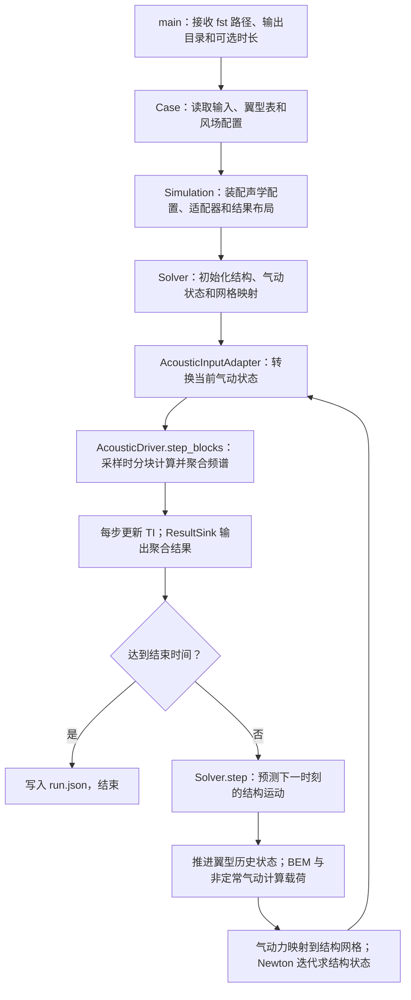

# IEA_LB_RWT-AeroAcoustics 工作流

本文沿着 `aeroacoustics_turbine` 的实际 C++ 调用链，说明官方算例从输入文件到结构、气动和声学结果的计算过程。对应 S1–S3 重构及 P4–P7 优化后的实现，层次、接口迁移和状态管理见 [仿真接口说明](docs/development.md#simulation)。文中的函数名均可在链接的源码中查到；调用树省略了标准库函数和通用向量运算。

R1–R3 更新增加了非法声级检查、同名 `.mask`、查表报告与严格策略，见 [可靠性说明](docs/validation.md#reliability)。

程序入口是 [src/apps/turbine_main.cpp](src/apps/turbine_main.cpp) 中的 `main()`。整机运行直接调用 C++ 模块，读取 OpenFAST 格式的输入文件；不启动 OpenFAST 可执行程序，也不调用 Fortran 或 Python。Fortran 参考程序属于验证流程，不进入下面的运行链。

## 1. 先看整条计算链



这里有两条不同的联系：气动与结构通过运动和载荷双向传递；声学读取叶片位置、速度、攻角等结果，声压不反过来参与结构或气动求解。

默认工况有三片叶片，每片三个结构模态，共九个结构自由度。转速和桨距固定，塔架、平台、传动链及控制器的动力学在该输入中关闭。

## 2. 程序输入什么

### 2.1 命令行入口

在仓库根目录运行已编译的程序，例如 Windows / MinGW：

```powershell
./build/aeroacoustics_turbine.exe examples/IEA_LB_RWT-AeroAcoustics/IEA_LB_RWT-AeroAcoustics.fst build/results
```

两个必需参数分别是主输入文件和输出目录。可选的第三个参数覆盖 `TMax`，例如末尾加 `2` 表示运行到约 2 秒的时间网格位置。默认算例运行到 20 秒。构建命令见 [README](README.md)。

### 2.2 输入文件之间的引用关系

以下文件均位于 [examples/IEA_LB_RWT-AeroAcoustics](examples/IEA_LB_RWT-AeroAcoustics)：

```text
IEA_LB_RWT-AeroAcoustics.fst
├─ EDFile → RotorSE_FAST_IEA_landBased_RWT_ElastoDyn.dat
│  └─ BldFile(1..3) → RotorSE_FAST_IEA_landBased_RWT_ElastoDyn_blade.dat
├─ InflowFile → RotorSE_FAST_IEA_landBased_RWT_InflowFile.dat
└─ AeroFile → RotorSE_FAST_IEA_landBased_RWT_AeroDyn.dat
   ├─ ADBlFile(1..3) → RotorSE_FAST_IEA_landBased_RWT_AeroDyn_blade.dat
   ├─ AFNames → Airfoils/RotorSE_FAST_IEA_landBased_RWT_AeroDyn_Polar_00.dat … 29.dat
   │  ├─ NumCoords → AFxx_Coords.txt：翼型轮廓和参考点
   │  └─ BL_file   → AFxx_BL.txt：尾缘几何及边界层数据
   └─ AA_InputFile → AeroAcousticsInput.dat
      └─ ObserverLocations → AA_ObserverLocations.dat
```

文件名相对于**引用它的输入文件所在目录**解析。三片叶片使用相同的结构属性表和气动站位表，但各自保存运动状态和非定常翼型历史状态。目录中的 `AA_ObserverLocations_Map.dat` 没有被当前 `ObserverLocations` 引用，因此不参与本次计算。

### 2.3 时间、环境和风场参数

| 来源 | 参数 | 官方值 | 进入哪里、起什么作用 |
| --- | --- | --- | --- |
| `.fst` | `TMax`、`DT` | 20 s、0.00625 s | `Case` → `Solver`：总时长和时间步长 |
| `.fst` | `ModCoupling`、`NumCrctn` | 3、0 | `Solver` 检查耦合配置，执行第 4 节所述推进顺序 |
| `.fst` | `RhoInf` | 0 | `Solver` 计算广义 α 积分系数 |
| `.fst` | `AirDens` | 1.225 kg/m³ | 气动力动压及声学模型 |
| `.fst` | `KinVisc` | 1.81206×10⁻⁵ m²/s | 雷诺数和边界层模型 |
| `.fst` | `SpdSound` | 335 m/s | 非定常气动、马赫数和声学模型 |
| `.fst` | `Gravity` | 9.80665 m/s² | `BladeStructure::acceleration()` 中的重力项 |
| Inflow 文件 | `WindType`、`HWindSpeed` | 1、8 m/s | `SteadyWind`：稳态风速 |
| Inflow 文件 | `RefHt`、`PLExp` | 110 m、0 | 幂律风切变；指数为 0 时风速不随高度变化 |
| Inflow 文件 | `PropagationDir`、`VFlowAng` | 0°、0° | 风向和垂直入流角 |

AeroDyn 文件中的 `AirDens`、`KinVisc`、`SpdSound` 当前为 `default`，采用 `.fst` 中的值；如果改成数值，则由 AeroDyn 值覆盖。`AcousticConfiguration` 将最终环境参数写入声学 `Parameters`，使气动与声学使用一致的介质属性。

### 2.4 结构与气动参数

| 来源 | 参数或数据 | 官方设置与用途 |
| --- | --- | --- |
| ElastoDyn 文件 | `NumBl`、`BldNodes` | 3 片叶片；每片 17 个结构积分节点，加根部和尖部形成 19 个运动节点 |
| ElastoDyn 文件 | `FlapDOF1`、`FlapDOF2`、`EdgeDOF` | 均开启：一阶挥舞、二阶挥舞、一阶摆振 |
| ElastoDyn 文件 | `RotSpeed`、`BlPitch(1..3)` | 固定 10.04 rpm、固定 1.17° |
| ElastoDyn 文件 | `TipRad`、`HubRad` | 65 m、2 m；柔性叶片长度为 63 m |
| ElastoDyn 文件 | `PreCone(1..3)`、`ShftTilt` | −2.5°、−5°，用于叶片与转子坐标变换 |
| ElastoDyn 文件 | `TowerHt`、`Twr2Shft` | 110 m、3.0934301742 m，用于轮毂几何位置 |
| 结构叶片文件 | `BlFract`、结构扭角、`BMassDen`、`FlpStff`、`EdgStff` | 插值质量和刚度分布，建立模态质量、刚度和阻尼 |
| 结构叶片文件 | `BldFl1Sh(2..6)`、`BldFl2Sh(2..6)`、`BldEdgSh(2..6)` | 三个模态的多项式系数 |
| 结构叶片文件 | `AdjBlMs`、`AdjFlSt`、`AdjEdSt`、`FlStTunr`、模态阻尼参数 | 调整质量、刚度和阻尼 |
| 气动叶片文件 | `NumBlNds` | 每片 30 个气动站位，全转子 90 个 |
| 气动叶片文件 | `BlSpn`、`BlCrvAC`、`BlSwpAC`、`BlCrvAng`、`BlTwist`、`BlChord`、`BlAFID` | 展向位置、预弯、后掠、局部角度、弦长和翼型索引 |
| AeroDyn 文件 | `Wake_Mod=1`、`BEM_Mod=1`、`DBEMT_Mod=0` | BEM 诱导求解，关闭动态入流状态模型 |
| AeroDyn 文件 | `TipLoss`、`HubLoss`、`TanInd` | 均开启：叶尖/叶根损失、切向诱导 |
| AeroDyn 文件 | `AIDrag`、`TIDrag` | 均关闭：诱导方程不计阻力项；最终气动力仍使用 `Cd` |
| AeroDyn 文件 | `Skew_Mod=1`、`SkewRedistr_Mod=default` | 按当前默认值执行偏斜尾流诱导重分布 |
| AeroDyn 文件 | `IndToler=default`、`MaxIter=100` | BEM 残差容差采用 5×10⁻¹⁰，最大迭代次数 100 |
| AeroDyn 文件 | `UA_Mod=3`、`FLookup=True` | Minnema/Pierce 非定常翼型模型，使用翼型表 |
| 翼型极曲线 | `NumAlf` 后的 `α, Cl, Cd, Cm` | `Airfoil::at()` 按攻角做线性插值 |
| 翼型极曲线 | `alpha0`、`C_nalpha`、`T_f0`、`T_V0`、`T_p`、`T_VL`、`b1/b2/b5`、`A1/A2/A5` 等 | 非定常模型的斜率、迟滞、分离和涡状态参数 |

极曲线文件的攻角以度给出，气动计算内部使用弧度；传给声学模块时再转换成度。这里的九个 `q` 是模态位移，九个 `qd` 是模态速度；30 个气动站位不是额外的结构自由度。

### 2.5 声学参数

| `AeroAcousticsInput.dat` 字段 | 官方值 | 用途 |
| --- | --- | --- |
| `DT_AA`、`AAStart` | 0.1 s、0 s | 声学计算/输出间隔与开始时间 |
| `BldPrcnt` | 70 | 从叶尖侧选取发声区域，由 `blade_elements()` 转换成离散节点及展向长度 |
| `TIMod` | 2 | 入流噪声加 Simplified Guidati 厚度修正 |
| `TICalcMeth`、`TI`、`avgV` | 1、0.1、8 m/s | 将指定湍流强度换算为各截面入射湍流强度 |
| `Lturb` | 40 m | 入流噪声的湍流长度尺度 |
| `TBLTEMod`、`BLMod`、`TripMod` | 1、1、1 | BPM 湍流边界层尾缘噪声；经验边界层；重绊线设置 |
| `BluntMod` | 1 | 启用尾缘钝度涡脱落噪声，读取 `TEThick`、`TEAngle` |
| `LamMod`、`TipMod` | 0、0 | 当前关闭层流边界层噪声和叶尖涡噪声 |
| `AWeighting` | False | 输出未加 A 计权的声级 |
| `NrOutFile` | 4 | 写入全部四类声学结果 |
| `AAOutFile` | `IEA_LB_RWT-AeroAcoustics_` | 输出文件名前缀 |

观察点为 `(175, 0, 2)` m 和 `(0, 175, 2)` m，采用塔基坐标系。34 个频带中心频率在 [include/aeroacoustics.hpp](include/aeroacoustics.hpp) 的 `Parameters::freqlist` 中定义，范围为 10–20000 Hz，并非从本算例的 AA 输入文件读取。

`TI=0.1` 用于入流噪声模型，不会在 `SteadyWind` 中生成随机湍流风场。`avgV` 和 `HWindSpeed` 是两个独立输入；修改风场速度时，程序不会自动修改声学 `avgV`。

## 3. 启动时先调用哪些模块

命令行只解析路径和 `RunOptions`，随后进入 [simulation.cpp](src/turbine/simulation/simulation.cpp) 中的库入口。

```text
main() → run_case(input, output, options)
├─ Case(input)：解析主文件、结构、气动、翼型及风场配置
├─ TurbineModel：复制并冻结 Case，configure_modules() 检查支持组合
├─ FileOutput(output)：创建目录，清空旧 run.json 成功记录
├─ Simulation(model, options)
│  ├─ AcousticConfiguration：读取声学参数、观察点，保存具名采样配置
│  ├─ OutputLayout：生成输出列，保存频带/计权元数据与具名自由度布局
│  ├─ AcousticInputAdapter：建立 Node 数组，按需读取边界层表和尾缘几何
│  ├─ AcousticDriver：建立频谱工作区、采样范围及初始 TI
│  ├─ AcousticAggregator：预分配总量、频带、机制、节点的声能数组
│  └─ Solver(model)
│     ├─ Rotor → BladeStructure、UnsteadyAirfoil、MotionMap、LoadMap
│     ├─ structural_dof_layout() → GeneralizedAlpha：建立积分系数、状态与耦合块工作区
│     └─ Rotor::evaluate_into(0, state, aerodynamic, workspace)
└─ run(simulation, sink)
   ├─ FileOutput::begin()：写通道标题，打开输出文件
   ├─ 循环 Simulation::next() → FileOutput::write()
   └─ FileOutput::finish()：检查写入及关闭，最后保存 run.json
```

首次气动求解仍发生在 `Solver` 构造末尾；初始模态位移、速度和积分器加速度为零。默认经验边界层不读取完整 BL 表；表格边界层或 TNO 分支在适配器初始化时构造 `PreparedBLTable`。

## 4. 一个时间步怎样推进

### 4.1 仿真循环的顺序

1. 首次 `Simulation::next()` 处理 `t=0`；之后的调用先检查结束条件，再执行 `Solver::step()`。
2. `AcousticInputAdapter::update()` 将气动状态写入 90 个声学节点；由 `is_sample_time()` 与 `first_node()` 决定是否执行边界层插值。
3. 采样时先调用 `AcousticAggregator::begin()`；`AcousticDriver::step_blocks()` 分块计算频谱，回调 `append()` 聚合。随后每步更新 TI；采样使用更新前的 TI。
4. 采样完成后调用 `AcousticAggregator::finish()`，返回含只读结构状态与可选声能结果的 `StepView`。
5. `FileOutput::write()` 按原格式写结构数据和声学结果。自定义接收器可以直接保存内存数据。

默认仍每 16 个动力学步采样一次：0–20 s 共 3200 步、3201 行结构数据和 201 个声学时刻。`StepView` 的引用只在下一次推进、恢复或重置前有效。

### 4.2 `Solver::step()` 的真实调用顺序

源码：[src/turbine/coupling/solver.cpp](src/turbine/coupling/solver.cpp)。

```text
Solver::step()
├─ GeneralizedAlpha::predict()：根据上一时刻状态及加速度历史，预测 q_pred、qd_pred
├─ Rotor::advance_airfoils(上一时刻气动结果, step_number)
│  ├─ UnsteadyAirfoil::advance()：推进翼型历史状态
│  └─ 保存上一时刻未经偏斜修正的 BEM 根 root_phi
├─ Rotor::evaluate_into(t_next, predicted, aerodynamic, workspace)：复用输出，计算一次新气动状态和载荷
├─ FixedBaseAcceleration：引用冻结的气动载荷，准备三片叶片的基底
└─ GeneralizedAlpha::correct()：结构 Newton 迭代，默认最多 12 次
   ├─ 对各耦合块调用 AccelerationOperator::evaluate()
   │  └─ FixedBaseAcceleration::evaluate() → Rotor::structural_acceleration()
   │  ├─ BladeStructure::motions_into()：用该叶片基底重建当前状态的全部节点运动
   │  ├─ structural_loads_into() → LoadMap::transfer_into()：用这些运动更新载荷力臂
   │  └─ BladeStructure::acceleration() → solve3()：复用同一组运动，解模态质量方程
   ├─ 扰动该叶片各模态，构造数值 Jacobian
   │  └─ structural_acceleration()：对每个扰动状态重新执行上述运动、映射和加速度计算
   ├─ solve()：解 Newton 修正方程（当前三模态块调用 solve3），修正加速度、q、qd
   └─ 检查修正量；收敛后保存状态并更新时间
```

**气动计算发生在结构 Newton 迭代之前。** 在这个迭代内，气动分布载荷保持为预测运动算出的值；结构节点位置和载荷力臂随结构修正而更新。不会在每次 Newton 迭代中重算 BEM，也不会在收敛后再调用一次 `Rotor::evaluate_into()`。

因此，同一时刻 `dynamics.csv` 保存的是修正后的结构状态，声学读取的是该步缓存的气动状态及其预测运动几何。下一步预测继续使用修正后的结构状态。这个先后顺序决定了气动、结构和声学之间的数据对应关系。

### 4.3 结构迭代求解什么

每片叶片的未知量是三个模态加速度。设当前猜测为 `a`，结构方程返回的加速度为 `f(q, qd, loads)`，残差为：

```text
r = f(q, qd, loads) - a
q  = q_pred  + beta_prime  * a
qd = qd_pred + gamma_prime * a
```

`beta_prime`、`gamma_prime` 来自 `DT`、`RhoInf` 对应的广义 α 系数。默认参考模式的数值 Jacobian 扰动量为 `h=1e-4`；每次迭代通过一个 3×3 系统求修正量。三片叶片的最大修正量范数小于 `1e-9` 时结束，12 次内不收敛则报错。

这里的 `1e-9` 和 12 次来自 `SolverOptions` 的默认值；输入文件里的 `ConvTol`、`MaxConvIter`、`DT_UJac` 等字段并未用于设置这段 Newton 循环。

固定塔架条件下，扰动一片叶片的模态不会改变另外两片的映射。因此每轮迭代逐片执行一次基础映射和三次扰动映射，三片合计 12 次。此处减少了重复计算，数值 Jacobian 的定义不变。

积分与 Newton 算法位于 `coupling/integrator.cpp`，三叶片物理适配位于 `coupling/structural_adapter.cpp`。`DofLayout` 将当前九个模态划分为三个独立块。通用积分器也能求解其他尺寸的完整耦合块；增加塔架、平台等共享自由度还需实现相应物理方程和耦合关系，不能只扩展数组。

## 5. 气动求解内部调用哪些函数

### 5.1 从叶片运动得到叶素气动力

协调入口：[src/turbine/coupling/rotor.cpp](src/turbine/coupling/rotor.cpp) 的 `Rotor::evaluate_into()`。

```text
Rotor::evaluate_into(time, state, output, workspace)
├─ 对三片叶片建立节点运动
│  ├─ blade_basis()：每片叶片准备一次基底
│  ├─ BladeStructure::motions_into() → motion(basis, state, node)、small_rotation()
│  ├─ MotionMap::transfer_into() → interpolate_rotation() → rotation_log()/rotation_exp()
│  ├─ SteadyWind::at(position)：求节点处的环境风速
│  └─ euler_angles()/euler_matrix()：建立叶素局部和环带坐标系
├─ 计算转子平均相对入流、偏斜角和低叶尖速比过渡权重
└─ 对三片叶片的 30 个站位分别计算
   ├─ solve_bem()：求未作偏斜修正的诱导状态
   ├─ skew_axial()：按模型开关修正轴向诱导
   ├─ 计算修正后的 phi、alpha 和相对速度 U
   ├─ UnsteadyAirfoil::evaluate(alpha, U)：求最终 Cl、Cd、Cm
   └─ 计算单位展长气动力和力矩，写入 AeroStation
```

`SteadyWind::at()` 给出环境风速，减去节点运动速度后形成叶素相对入流。BEM 再计算诱导效应，得到用于最终气动力和声学的截面相对速度。因叶片旋转和变形，声学的 `Section::speed` 通常不等于输入文件中的 8 m/s。

`SkewOptions` 在 `Rotor` 构造时保存偏斜修正开关和系数，节点循环直接读取这些数值，不再重复从输入字符串转换。

气动力使用 `q_dyn = 0.5 × ρ × U²`，再乘弦长及升阻力系数组合；力矩使用 `q_dyn × chord² × Cm`。结果转换到全局坐标，存入 `AeroStation::load`。

### 5.2 BEM 如何求诱导系数

源码：[src/turbine/aerodynamics/bem.cpp](src/turbine/aerodynamics/bem.cpp)。

```text
solve_bem(options, input, airfoil, previous_phi)
├─ 处理根尖边界、零速度分量等特殊情况
├─ 利用 previous_phi 确定求根区间的搜索顺序
└─ 在区间内反复求 bem_residual(phi)，用 Brent–Dekker 方法寻找根
   ├─ Airfoil::at(phi - twist)：插值得到静态 Cl、Cd、Cm
   ├─ prandtl_loss()：计算根部与尖部损失因子
   └─ induction_factors()：求轴向/切向诱导系数及残差
      └─ 按流动区间使用动量关系、Buhl 高诱导修正或制动分支
```

BEM 求根的未知量是入流角 `phi`；攻角为入流角减局部扭角。求根阶段调用静态极曲线 `Airfoil::at()`。取得诱导状态并完成偏斜修正之后，才调用非定常翼型模型计算载荷系数。

因此，`UnsteadyAirfoil::evaluate()` 不在 `bem_residual()` 的内部。这也将 BEM 的求根迭代与翼型历史状态推进分开。

### 5.3 非定常翼型模型怎样使用历史状态

源码：[src/turbine/aerodynamics/unsteady.cpp](src/turbine/aerodynamics/unsteady.cpp)。

| 函数 | 调用时机 | 内部工作与输出 |
| --- | --- | --- |
| `UnsteadyAirfoil::advance()` | `Rotor::advance_airfoils()` 中，用上一时刻的攻角和速度推进 | 调用 `chain()`，更新分离/涡状态标志及 `previous_` 等历史变量；初始化步有专门处理 |
| `UnsteadyAirfoil::evaluate()` | BEM 及偏斜修正完成后 | 先取得静态系数；启用非定常计算时调用 `chain()`，返回当前 `Cl/Cd/Cm`，不改写历史变量 |
| `UnsteadyAirfoil::chain()` | 上述两个函数按各自用途调用 | 计算攻角滤波、附着流迟滞、压力滞后、分离和涡升力链 |
| `decay()` | `chain()` 内多处 | 计算指数迟滞项 |
| `separation()`、`chord_separation()` | `chain()` 内 | 调用 `Airfoil::at()`，计算法向和弦向分离相关量 |
| `blend()` | `evaluate()` 内 | 大攻角切出与低速区域中平滑过渡到静态结果 |

每个气动节点独立保存历史。非定常模型未启用或尚处于初始状态时，`evaluate()` 返回静态极曲线结果；不会因为一次求根或结构迭代而反复推进物理时间。

## 6. 结构、运动映射和载荷映射怎样连接

### 6.1 叶片结构模块

源码：[src/turbine/structure/blade_dynamics.cpp](src/turbine/structure/blade_dynamics.cpp)。

| 函数 | 输入 → 输出 | 主要计算 |
| --- | --- | --- |
| `BladeStructure()` | 结构输入表 → 模态和节点属性 | 调用 `shape()` 计算模态多项式及导数；插值质量/刚度分布，积分形成模态质量、刚度和阻尼 |
| `blade_basis()` | 时间、叶片编号 → 基准方向矩阵 | 合成方位角、固定转速、预锥角、轴倾角和桨距 |
| `motion()` | 时间、`ModalState`、结构节点 → `Motion` | 计算位置、姿态、速度、角速度、广义速度偏导和惯性加速度项，包含旋转与轴向缩短 |
| `acceleration()` | `ModalState` 和节点载荷 → 三个模态加速度 | 组装广义气动力、重力、惯性、弹性和阻尼项，再调用 `solve3()` 解质量方程 |

`motions_into()` 批量计算节点运动并复用目标数组。结构残差或 Jacobian 扰动的一次求值中，载荷映射和加速度装配共用这组运动；状态变化后立即重建。Newton 迭代使用的叶片基底在进入迭代前准备，同一时间步内各节点共用。

### 6.2 两种网格的传递方向

源码：[src/turbine/coupling/mesh.cpp](src/turbine/coupling/mesh.cpp)。

```text
结构模态 q、qd
   │ BladeStructure::motions_into()
   ▼
每片 19 个结构运动节点
   │ MotionMap::transfer_into()：位置、姿态、速度和角速度插值
   ▼
每片 30 个气动站位
   │ Rotor::evaluate_into()：BEM + 非定常气动
   ▼
单位展长气动力 N/m、单位展长力矩 N·m/m
   │ LoadMap::transfer_into()：线载荷积分、分配及力臂修正
   ▼
每片 17 个结构积分节点上的集中力 N、力矩 N·m
   │ Rotor::structural_loads_into()：补齐根、尖零载荷节点
   ▼
BladeStructure::acceleration() → 模态加速度 → Solver 修正 q、qd
```

`MotionMap` 和 `LoadMap` 在初始化时建立参考网格关系，运行时使用当前运动和位置传递数据。载荷传递包含力矩与力臂的处理，不能只把 30 个气动力数值线性插值到 17 个位置。

## 7. 声学模块怎样得到各观察点的频谱

### 7.1 气动结果转为声学输入

`AcousticInputAdapter::update()` 将 `AeroStation` 的动态数据写入声学 `Node`：

| 气动/输入数据 | 声学字段 | 用途 |
| --- | --- | --- |
| `a.motion.position`、`a.motion.orientation` | `aero_center`、`global_to_local` | 声源与观察点之间的距离和方向 |
| `a.wind` | `inflow` | 声学湍流状态输入 |
| `a.speed`、`a.alpha` | `section.speed`、`section.alpha_deg` | 相对速度、攻角、雷诺数及噪声模型输入 |
| 气动站位弦长、翼型 `alpha1` | `section.chord`、`section.stall_deg` | 截面尺度和失速参考角 |
| 翼型坐标、参考点 | 厚度参数、`airfoil_reference` | Guidati 修正及前后缘位置 |
| `TEThick`、`TEAngle` | `section.te_thickness`、`section.te_angle` | 尾缘钝度噪声 |
| `blade_elements()` 结果 | `section.span`、是否叶尖 | 单段展向积分长度与声源选择 |

默认声学模型读取的是叶素速度、攻角、几何及边界层参数，不是将 `load.force` 直接转换成声压，也不对气动力时序做 FFT。

### 7.2 声学驱动与时间状态

源码：[src/acoustics/driver.cpp](src/acoustics/driver.cpp)。

```text
AcousticDriver::step_blocks(time, nodes, callback, block_size)
├─ 遍历所有叶片节点，整理速度、入流和前缘位置
├─ 若 time ≥ AAStart 且位于 DT_AA 采样网格
│  ├─ 将 BldPrcnt 对应的节点写入预分配数组
│  │  └─ 写入展向长度、叶尖标记、已保存的截面湍流强度
│  └─ AcousticWorkspace::evaluate_blocks(selected_nodes, observers, callback, block_size)
│     ├─ 对每个选中节点调用 prepare_section()，准备边界层与声源谱形
│     └─ 分块遍历观察点，对块内每个观察点、每个选中节点
│        ├─ observe()：求前缘和尾缘相对观察点的距离、theta、phi
│        ├─ emit_section()：施加距离和指向性，装配 7 类机制 × 34 个频带
│        └─ 完成当前块后回调 AcousticAggregator::append()
└─ TurbulenceState::update()：更新状态，供下一次调用使用
```

官方 `BldPrcnt=70` 对应阈值 `63 × (1 − 0.7) = 18.9 m`。按当前 `blade_elements()` 的离散选取规则，第一发声节点是输入表的第 9 个节点（`BlSpn=17.8374 m`，C++ 索引 8），至第 30 个节点止：每片 22 个，全转子 66 个。模型中的 `section.span` 是该节点代表的展向段长度，不是节点距叶根的位置。

`TICalcMeth=1` 时，更新公式为 `TI_section = TI × avgV / U_relative`。本次频谱先使用已保存的 `TI_section`，再用当前速度更新它；初始保存值为 0，所以 `t=0` 具有专门的初始状态含义。虽然两个声学输出相隔 0.1 s，湍流状态仍每 0.00625 s 更新一次。

`AcousticWorkspace` 位于 [workspace.cpp](src/acoustics/workspace.cpp)。其构造函数校验并保存固定声学参数，预计算 A 计权；工作区复用声源、频谱和 TNO 积分数组。回调中的频谱块由工作区持有，仅在本次回调期间有效。`step_view()` 仍返回完整借用快照，`step()` 返回独立快照，`snapshot_spectrum()` 和 `section_spectrum()` 仍提供一次性计算接口。整机主循环使用 `step_blocks()` 限制观察点频谱的暂存规模。

### 7.3 默认实际执行的噪声函数

声源调度在 [spectrum.cpp](src/acoustics/spectrum.cpp)，模型文件见 [源码索引](docs/development.md#source)，几何变换在 [geometry.cpp](src/acoustics/geometry.cpp)。计算分为节点声源准备和观察点频谱装配两个阶段：

```text
prepare_section(parameters, section, integration_workspace, prepared)
├─ 检查截面物理量，处理最低速度和攻角周期
├─ boundary_layer() → thick() → log10aa()：边界层只准备一次
├─ prepare_trailing_edge()：BPM 压力面、吸力面和分离噪声谱形
│  └─ a0comp()/amin()/amax()/bmin()/bmax()、log10aa()
├─ prepare_blunt() → g5comp()、log10aa()：钝度噪声谱形
├─ prepare_inflow()：Lowson 入流声源及高低频修正
└─ prepare_guidati()：翼型厚度修正

emit_section(parameters, prepared, leading, trailing, weighting, output)
├─ 检查观察点几何，初始化七类机制输出
├─ emit_trailing_edge() → directh_te()/directl()：三个 BPM 尾缘分量
├─ emit_blunt() → directh_te()：钝度分量
├─ emit_inflow() → directh_le()/directl()：入流分量
└─ TIMod=2 时，对入流分量加 Guidati 修正及 10 dB 项
```

两个观察点共用每个节点的一份 `PreparedSection`，但分别计算距离和指向性。节点速度、攻角等变化后，会在下一个采样时刻重新准备声源。各模型直接计算指定频带的统计声压级，不生成时域声压波形。

原有 `tblte()`、`blunt()`、`inflownoise()`、`simple_guidati()` 等标量接口保留在 [kernel_compat.cpp](src/acoustics/kernel_compat.cpp)，内部转接到上述同一组模型函数，用于兼容外部调用及 Fortran 公式对照。

### 7.4 源码中存在、但官方默认工况未走的分支

| 分支条件 | 调用链 | 当前默认状态 |
| --- | --- | --- |
| `LamMod=1` 且 `TripMod=0` | `prepare_laminar()` → `emit_laminar()`，使用共享边界层及 `directh_te()` | 关闭 |
| `TipMod=1` 且节点为叶尖 | `prepare_tip()` → `emit_tip()` → `directh_te()` | 关闭 |
| `BLMod=2` 或 `TBLTEMod=2` | 初始化读取并构造 `PreparedBLTable`；仅在声学采样时对选中节点调用 `interpolate(alpha, Re, chord)` | 关闭；默认使用经验边界层 |
| `TBLTEMod=2` | `prepare_tno()` → `prepare_profile()` / `integrate_profile()` → `exponential()`、`dot()`；再由 `emit_tno()` 计算观察点频谱 | 关闭；TNO 替换压力面/吸力面分量，分离分量仍来自 BPM |
| `AWeighting=True` | 初始化时调用 `a_weighting()`，`emit_section()` 给各频谱加修正 | 关闭 |

TNO 位于 [src/acoustics/tno.cpp](src/acoustics/tno.cpp)。`prepare_tno()` 先调用 `prepare_profile()` 缓存一侧的边界层及积分常数，再逐频率调用 `integrate_profile()`，以 61 点节点和权重装配积分；积分结果跨观察点共用。原 `spl_integrate()` 通过 `integrate_tno()` 保留一次性准备剖面和积分的接口。这里没有调用通用的 `qk61()` 包装函数；`qk61()` 位于 [src/numerics/quadrature.cpp](src/numerics/quadrature.cpp)，用于独立积分功能及验证。默认整机 BPM 路径不经过 TNO 积分。

`TurbulenceState` 还实现了 `TICalcMeth=2` 的统计分支，但当前整机入口的 `Case::validate_scope()` 要求该值为 1。声学 C ABI 位于 `src/interfaces/c_api.cpp`；整机程序直接使用 C++ 接口，不经过这一层。

## 8. 频谱如何汇总、最终输出什么

完整 `AcousticWorkspace::evaluate()` 快照维度如下；整机默认只暂存其中一个观察点，逐块聚合：

```text
Snapshot[观察点][选中的节点，按叶片依次排列][声源机制][频率]
默认维度：2 × 66 × 7 × 34
```

七个机制的固定顺序为：`LBL`、`TBL_pressure`、`TBL_suction`、`TBL_separation`、`bluntness`、`tip`、`inflow`。关闭的机制在内部初始化为负无穷，对声能总和贡献为零。

`AcousticAggregator::append()` 将当前块中每个声级转换为相对声能，再按观察点、频率、机制或节点求和；`FileOutput::write()` 调用 `output_decibels()` 转回 dB：

```text
E_k   = 10^(L_k / 10)
L_sum = 10 × log10(Σ E_k)
```

这个求和发生在聚合器中，未调用库里的 `db_sum()`。不能直接对不同节点或机制的 dB 数值作算术求和或平均。声级参考声压为 20 μPa。

只为 `NrOutFile` 请求的类别预分配聚合数组，每次采样清零后重新累加；未请求类别不分配标签和结果数组，所有启用声源仍计入总声能。`aggregate()` 保留为完整快照的便捷接口。

| 文件 | 聚合方式/内容 | 默认数据规模，不计表头 |
| --- | --- | --- |
| `IEA_LB_RWT-AeroAcoustics_1.out` | 对节点、机制和频带求和，每个观察点一个总声级 | 201 行；时间 + 2 列 |
| `IEA_LB_RWT-AeroAcoustics_2.out` | 对节点和机制求和，保留观察点及频带 | 201 行；时间 + 68 列 |
| `IEA_LB_RWT-AeroAcoustics_3.out` | 对节点求和，保留观察点、频带和机制 | 201 行；时间 + 476 列 |
| `IEA_LB_RWT-AeroAcoustics_4.out` | 对频带和机制求和，保留叶片、节点和观察点 | 201 行；时间 + 180 列 |
| `dynamics.csv` | 三片叶片各自的三个 `q` 和三个 `qd` | 3201 行；时间 + 18 列 |
| `run.json` | 实际时长、步长、步数、声学采样次数、运行耗时 | 一份运行记录 |

第 4 个文件仍为全部 90 个气动节点保留列，未选入声学范围的节点写入零声能对应的 `0 dB` 占位值。关闭机制等零声能项也遵循兼容输出中零声能写为 `0 dB` 的约定。每份 `.out` 的同名 `.mask` 与时间/通道逐项对应：0 表示零声能占位，1 表示有效正声能；应结合掩码解释这些零值。

### 8.1 TNO 缓存、并行与求解诊断

TNO 在 `prepare_profile()` 中为当前节点、当前侧计算一次 61 点边界层剖面；`integrate_profile()` 对各频率按行连续装配矩阵并积分。频带宽度在频率列表变化时更新，积分求和顺序保持不变。

批量入口 `aeroacoustics_batch` → `run_cases()` → 各线程独立 `run_case()`。各工况分别持有 `Simulation`、TNO 工作区和诊断会话；同一个工况的时间步仍依次推进。

`--solver=scaled` 可选择尺度化扰动、修正量与残差共同判停，以及同一步内 Jacobian 复用；残差停滞/恶化或连续复用两次后重建。默认 `reference` 保留每轮重建与原判停条件。`Solver::diagnostics()` 与 `run.json` 给出迭代和计算次数，失败报告附带时间、叶片和残差。完整参数与验证见 [P4–P7 说明](docs/performance.md#p4-p7)。

### 8.2 频带、单位和模块元数据

`FrequencyBands::openfast_reference()` 为原 34 个名义中心分配不重叠的二进制三分之一倍频程边界。`AcousticAggregator` 验证中心列表，将声级转换成相对均方声压后叠加；`AcousticResult::power` 的含义是 `〈p²〉/(20 μPa)²`，并非声功率 W。结果携带频带与计权状态，`FileOutput` 检查匹配后写出 dB 或 dBA。

`run.json` 保存参考声压、频带边界、TNO 参考带宽约定，以及结构自由度名称、单位、尺度和耦合块。另有 `PressurePsd`、`BandMeanSquarePressure`、`BandSoundPressureLevel`、`BandSoundPower` 等类型供库调用；PSD 要先按 Hz 带宽积分，不能直接与频带能量混用。详细公式与接口见 [S4–S5 说明](docs/development.md#quantities-modules)。

## 9. 按问题定位源码

可选工程配置的调用链见下节；不启用时仍按前述官方参考路径运行。

| 想查看或修改什么 | 先看哪一处 | 后续会影响什么 |
| --- | --- | --- |
| 输入如何识别、路径如何展开 | [case_input.cpp](src/turbine/io/case_input.cpp)：`InputFile`、`Case` | 全部模块初始化 |
| 风速、风切变、风向 | Inflow 输入；`SteadyWind::at()` | 相对入流 → BEM → 载荷、结构响应和声学 |
| 叶片质量、刚度、阻尼、模态 | 结构叶片输入；[blade_dynamics.cpp](src/turbine/structure/blade_dynamics.cpp) | 运动学、结构方程和气动反馈 |
| 诱导、损失因子、求根 | [bem.cpp](src/turbine/aerodynamics/bem.cpp) | 截面速度、攻角和全部下游计算 |
| 动态失速和非定常系数 | [unsteady.cpp](src/turbine/aerodynamics/unsteady.cpp) | 气动力与后续结构响应 |
| 结构和气动网格怎么连接 | [mesh.cpp](src/turbine/coupling/mesh.cpp) | 节点运动插值和载荷传递 |
| 哪个模块先算、什么时候迭代 | [solver.cpp](src/turbine/coupling/solver.cpp)、[rotor.cpp](src/turbine/coupling/rotor.cpp) | 时间推进和耦合次序 |
| 声源范围、采样间隔、TI 状态 | AA 输入；[driver.cpp](src/acoustics/driver.cpp) | 声学选点、时间状态和输出时刻 |
| 观察点怎么影响结果 | Observer 输入；[geometry.cpp](src/acoustics/geometry.cpp)：`observe()` | 距离和指向性，再进入各噪声模型 |
| 噪声机制开关、模型公式 | [spectrum.cpp](src/acoustics/spectrum.cpp)、[模型文件索引](docs/development.md#source) | 七类机制频谱 |
| 频谱和积分缓冲区、跨观察点共享计算 | [workspace.cpp](src/acoustics/workspace.cpp)、[source_models.hpp](src/acoustics/source_models.hpp) | 声学运行效率与返回数据的生命周期 |
| 频率列表 | [aeroacoustics.hpp](include/aeroacoustics.hpp)：`Parameters::freqlist` | 频谱维度和输出列数，修改后需重新编译 |
| 输出列、声级聚合、文件命名 | [results.cpp](src/turbine/simulation/results.cpp)、[file_output.cpp](src/turbine/simulation/file_output.cpp) | 四个声学文件、结构 CSV 和运行记录 |

完整阅读顺序可沿 `main()` → `run_case()` → `Simulation` → `Solver` → `Rotor` 展开；查气动算法进入 `bem.cpp` 和 `unsteady.cpp`，查结构进入 `blade_dynamics.cpp` 和 `mesh.cpp`，查声学进入 `driver.cpp` → `workspace.cpp` → `spectrum.cpp` → 各模型的 `prepare_*()` 与 `emit_*()`。

P1–P3 的缓冲区所有权、接口使用约定和配对计时见 [耦合与采样优化](docs/performance.md#p1-p3)。

S1–S3 将状态读取改为 `solver.state()`、`time()`、`aerodynamic()` 等只读接口；`checkpoint()`/`restore()` 同时处理结构、气动和声学历史。完整契约见 [仿真接口说明](docs/development.md#simulation)。

## 10. E1–E2 可选工程配置

命令行先读取 `--wind-grid`、`--controller`、`--propagation`，分别建立只读风场、控制器参数和传播参数。它们通过 `RunOptions` 进入 `Simulation`；不指定时保留原参考路径。

```text
Solver::advance()
  GeneralizedAlpha::predict()              预测叶片模态
  Rotor::aerodynamic_torque()              对上一步气动力积分求轴转矩
  Rotor::wind_at()                         查询轮毂风向
  OperatingController::advance()           RK4 子步：轴扭转、转子/发电机、滤波、PI、执行器
  BladeStructure::set_operation()          更新积分方位角、转速、桨距、偏航及导数
  Rotor::advance_airfoils()                UA 历史推进一次
  Rotor::evaluate_into()
    WindField::at(time, position)           各叶素查询三分量非稳态风
    运动映射 → BEM → 气动力
  GeneralizedAlpha::correct()              固定本步运行状态/气动载荷，校正叶片模态

声学采样
  prepare_section() → emit_section()        原距离、指向性和机制频谱
  若有地面反射：对镜像受声点再 emit_section()
  OutdoorPropagation::apply()              路径吸收、频带干涉、主导屏障衍射
  AcousticAggregator::append()             叠加各节点和机制能量
  FileOutput                              声学文件、模态、operation.csv、元数据
```

新增传动链/执行器是与叶片模态分步交换数据的独立状态系统；主时间步内其气动输入冻结。传播使用均匀介质直线路径，已有 `1/r²` 不会重复计算。新示例、单位、控制参数和数值收敛结果见 [E1–E2 工程说明](docs/engineering.md)。

## 11. E3、E5、E7：表面数据与接收点工程统计

```text
main()
  SurfaceSet::read(--surfaces)             清单 → SurfaceData → 极曲线/UA/坐标、边界层、来源与适用范围
  MetricsOptions::read(--metrics)          分析时段、接收网格、AM、风速箱、测点、独立音调
  Simulation::Impl()
    SurfaceSet::apply()                    按 AirfoilID 替换指定翼型，随后冻结 TurbineModel
    configuration()                       可替换观察点地图，其余声源输入保持原定义
    AcousticInputAdapter                  保存只读 SurfaceSet 与普通边界层表
    EngineeringMetrics                    分配节点接收历史；配置不兼容时拒绝

每个结构步
  Solver → Rotor → BEM/UA/结构              新极曲线进入气动计算；边界层单独替换不改变动力学
  AcousticInputAdapter::update()
    SurfaceData::at()                     检查实际攻角/Re，插值 dstar/d99/Cf/Ue
    Section::tabulated_boundary_layer      仅指定截面切换为数据表边界层

每个声学采样时刻
  AcousticDriver::step_blocks()
    prepare_section() → boundary_layer() → emit_section() → 可选传播
    回调 AcousticAggregator::append()       原源时间七类通道
    回调 EngineeringMetrics::append()       前缘/尾缘分别确定接收时刻，保存各频带声能
      ArrivalSeries::append()              检查时间单调性、数据量上限
      独立音调                            给定参考 SPL、频率/阶次、附着节点 → 几何衰减与时延

运行完成
  Simulation::summary()                    包含独立的只读工程历史快照
  FileOutput::finish()
    EngineeringMetrics::write()
      求所有路径和观察点的公共接收区间
      ArrivalSeries::at()                  在接收时间上插值均方声压，合成受声点总量
      ArrivalSeries::doppler()             独立音调的接收频率与频带归属
      level_statistics()                  时间积分 LAeq；时间加权 L5/L50/L95
      风速分箱                            跨箱间隔切分，再累计时长与声能
      modulation()                        完整窗口的描述性谐波调制指标
      apparent_sound_power()              仅显式启用且满足自由场条件时换算
      写 receiver_history/map、wind_bins、am_windows、receiver_tones、metrics.json
    写 surface_datasets.csv
    全部输出成功后写 run.json
```

检查点和重置包含新增接收历史，表面数据保持只读。宽带时延是声级包络处理，音调来自外部输入；它们不产生音频波形，也不代替完整 IEC/IOA 评价流程。详细单位、数据来源与组合限制见 [工程模型](docs/engineering.md#receiver-metrics)。


## 12. E8 独立数据验证与不确定性

运行顺序为：准备工况与测量数据 → 运行 C++ 整机/批量算例 → 导入或整理对应预测量 → 执行 `aeroacoustics_validate`。此程序独立于整机时间积分，不改变声源模型或自动校准结果。

| 命令 | 入口调用 | 数值函数 | 输出 |
| --- | --- | --- | --- |
| `import-map` | `import_receiver_map()` | 读取并核对接收点坐标、时间窗和 LAeq | 与测量 CSV 同格式的预测表 |
| `compare` | `compare_files()` | `residual()` → `error_statistics()`，校准/验证和试验批次分组 | 配对残差、偏差/MAE/RMSE、归一化误差 |
| `budget` | `budget_files()` | `uncertainty_budget()`，中心差分与相关矩阵分解 | 左右导数、曲率、标准/扩展不确定度 |
| `ensemble` | `ensemble_file()` | `ensemble_statistics()`，均值/标准差/分位数 | 等权模拟样本的分布摘要 |

测量来源、数据划分、单位、适用条件、不确定度和计算来源须随输入提供。扰动计算或联合分布抽样由调用方组织；测试脚本只调度 C++，不实现物理和统计算法。详细输入格式和示例见 [E8 验证说明](docs/validation.md#independent-validation)。
